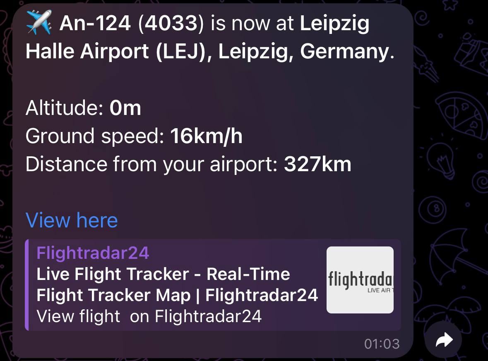
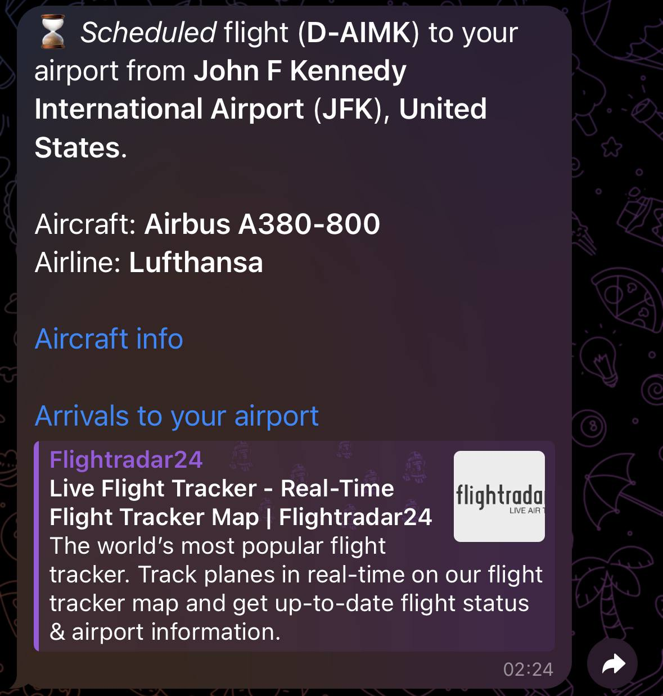

# Plane Spotting Telegram Bot

[](https://skillicons.dev)

## Introduction

Since I am an avgeek and plane spotter, I use Flightradar24 like everyone else, but I am missing some features.

- First of all, even though flightradar has an alert system, it does not track flights with flight number N/A. This is a problem for me since almost all An-124s have little to no flight information.
- Secondly it doesn't notify about scheduled flights I am interested in.

Of course, there may be simpler solutions to these problems, but I decided to create my own in the form of a Telegram bot.
The bot is able to **notify** about all flying **An-124s**, as well as about **all wide-body aircraft** (**and Boeing 757**) that will make a scheduled flight to the airport of your choice.

#### An-124 and Wide-body flight notification example
<div style="display: flex; justify-content: space-between;">
    
    
</div>

### Main Bot Commands
- **/changeairport** - Change your airport by Iata or Icao code.
- **/currentairport** - Get your current airport name and Iata code. 
- **/changemode** - Change bot mode.
    + **All** - You will receive notifications about An-124 flights **and** wide-body aircraft flights.
    + **Wide-body** - You will receive notifications **only** for wide-body aircraft.
    + **An-124** - You will receive notifications **only** about An-124 flights.
    + **Mute** - You will not receive **any** notifications.
- **/currentmode** - Get current bot mode.
- **/lang** - Change bot language.
    + English
    + Ukrainian
    + Russian
- **/setemail** - Add email to send you mail if An-124 in your airport.
- **/myemail** - Get your email.
- **/removeemail** - Remove your email from the bot.

Project **deployed**, and you can try it out [here](https://t.me/Avgeek_ViLsonCake_Bot).

## Installation

1. Install Docker [here](https://docs.docker.com/engine/install/).
2. Create a Telegram bot using [BotFather](https://t.me/BotFather).
3. Create Geonames account [here](https://www.geonames.org/export/web-services.html).

4. Create an **.env** file
    ```dotenv
    API_KEY=YOUR_RANDOM_API_KEY
    API_URL=http://localhost:8000
    API_DOCKER_URL=http://flightradar-api:8000

    GEONAMES_URL=http://api.geonames.org/searchJSON
    GEONAMES_USERNAME=YOUR_GEONAMES_USERNAME

    BOT_NAME=YOUR_BOT_NAME
    BOT_TOKEN=YOUR_TOKEN
    BOT_CREATOR_ID=YOUR_TELEGRAM_USER_ID

    POSTGRES_HOST=avgeek_bot_postgres
    POSTGRES_DOCKER_PORT=YOUR_DOCKER_PORT
    POSTGRES_USER=YOUR_POSTGRES_USER
    POSTGRES_PASSWORD=YOUR_POSTGRES_PASSWORD
    POSTGRES_DB=YOUR_DB_NAME

    RABBITMQ_USERNAME=YOUR_RABBITMQ_USERNMAE
    RABBITMQ_PASSWORD=YOUR_RABBITMQ_PASSWORD
    RABBITMQ_HOST=localhost
    RABBITMQ_DOCKER_HOST=avgeek-rabbitmq

    MAIL_USERNAME=YOUR_BOT_EMAIL_ADDRESS
    MAIL_PASSWORD=YOUR_BOT_EMAIL_PASSWORD
    ```

5. Run the application in **Docker**:
    ```
    docker compose up --build -d
    ```
